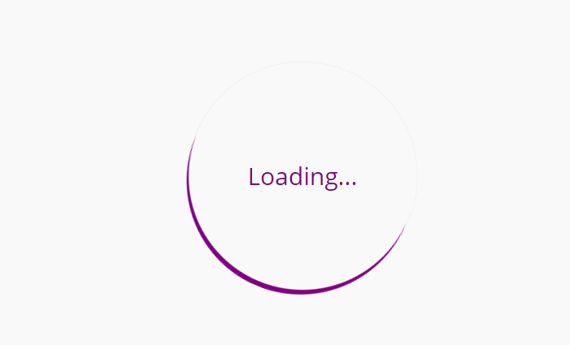
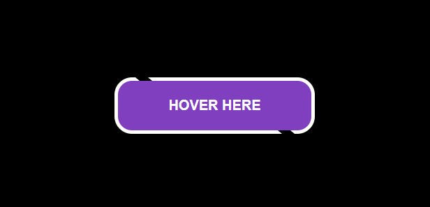
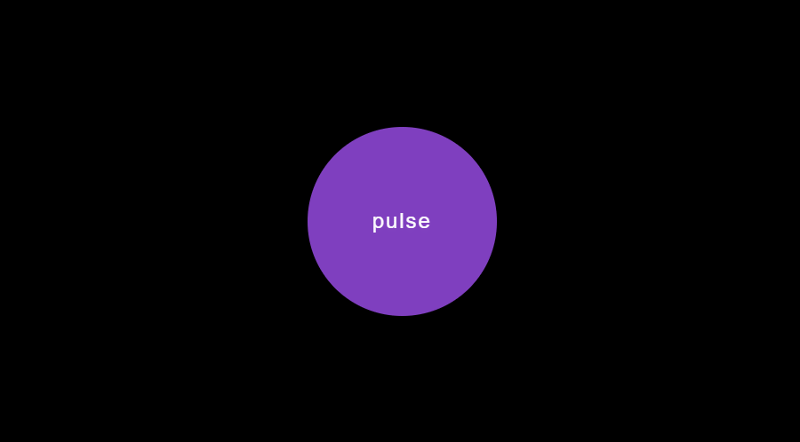
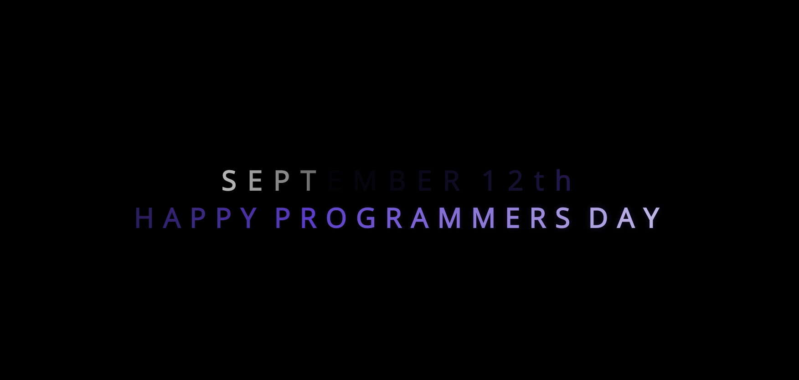

# 30 Days Of CSS 👩‍💻
30 Days of CSS is a challenge to help you improve your coding skills by doing mini daily projects using HTML and CSS.

## Rules
This is a project from <a href="https://github.com/MilenaCarecho/30diasDeCSS" target="_blank">Milena Carecho</a> next to some youtube channels (<a href="https://www.youtube.com/channel/UCbwXnUipZsLfUckBPsC7Jog" target="_blank">Online Tutorials</a>, <a href="https://www.youtube.com/channel/UCOKmVksbzoKJKmtu7rlEM1A" target="_blank">Creative Creations</a>, <a href="https://www.youtube.com/channel/UCD3KVjbb7aq2OiOffuungzw" target="_blank">Dark Code</a>) as references for the challenges.

In her repository, Milena created some rules as a suggestion:

• Carry out a new project every day (not necessarily for 30 days in a row) 
• Do not repeat a project already created 
• The project must be completed until 11:59pm 
 
<a href="https://github.com/MilenaCarecho/30diasDeCSS" target="_blank">Click here</a> to participate! :rocket:

## Day01 - social media icons

<a href="https://github.com/cunhasbia/30DaysOfCSS/tree/master/Day01" target="_blank">Click here to view my code.</a>

## Day02 - animated loader

<a href="https://github.com/cunhasbia/30DaysOfCSS/tree/master/Day02" target="_blank">Click here to view my code.</a>

## Day03 - sliding text

<a href="https://github.com/cunhasbia/30DaysOfCSS/tree/master/Day03" target="_blank">Click here to view my code.</a>

## Day04 - button with hover effect

<a href="https://github.com/cunhasbia/30DaysOfCSS/tree/master/Day04" target="_blank">Click here to view my code.</a>

## Day05 - pulse

<a href="https://github.com/cunhasbia/30DaysOfCSS/tree/master/Day05" target="_blank">Click here to view my code.</a>

## Day06 - text animation

<a href="https://github.com/cunhasbia/30DaysOfCSS/tree/master/Day06" target="_blank">Click here to view my code.</a>

## Day07 - preloader

<a href="https://github.com/cunhasbia/30DaysOfCSS/tree/master/Day07" target="_blank">Click here to view my code.</a>
